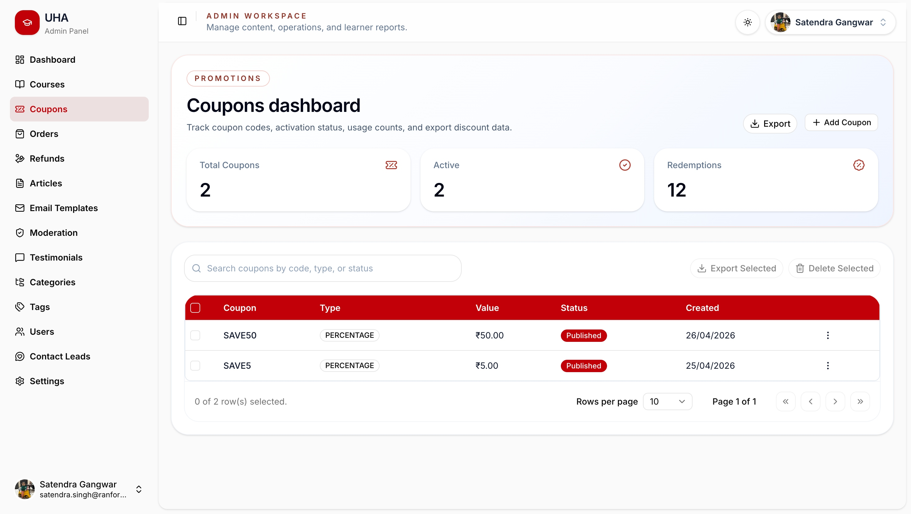

# Kasa Enterprise

**Kasa Enterprise** is a complete full-stack Learning Management System built with **Next.js**, **NestJS**, and **PostgreSQL**.

It is designed as a production-style LMS platform with separate role-based dashboards for **Admin**, **Faculty**, and **Students**. The system includes course management, course purchases, coupons, orders, learning progress, exams, reviews, articles, permissions, role management, contact leads, testimonials, email templates, logs, and complete platform settings.

---

## Docker Quick Start

Fresh clone flow:

```bash
./scripts/register-kasa-command.sh
kasa install dev
```

Then open:

- Installer: http://localhost:3000/install
- Client: http://localhost:3000
- API: http://localhost:8000
- Swagger: http://localhost:8000/api

The first run opens the installation wizard. It checks the database, asks for
academy details, activates the license key through the Kasa Licence Portal,
creates the first admin user, and can import the demo data with a live progress
bar.

For local testing, run the Kasa Licence Portal on port `5000`, generate a
`kasa-enterprise` key there, and keep `LICENSE_PORTAL_URL=http://localhost:5000`.
When Kasa Enterprise runs in Docker, it automatically routes that localhost URL
to the host machine internally.

Database name is configurable in `.env.docker` through `POSTGRES_DB`. On a new
Docker volume, PostgreSQL creates that database automatically.

Local PostgreSQL is exposed on host port `5433` by default so it does not clash
with Postgres already running on your machine. The app containers still connect
to Postgres on container port `5432`.

Short commands:

```bash
kasa install dev
kasa install dev -r
kasa install app
kasa start dev
kasa start app
kasa stop
kasa restart dev

make install-dev
make install-app
make dev
make dev-down

make prod
make prod-down
```

What they do:

- `kasa install dev`: creates `.env.docker` if needed, starts the development stack, and prints setup URLs.
- `kasa install dev -r`: stops the development stack, resets the bundled Docker database, backs up the current `.env.docker`, recreates `.env.docker` from `.env.docker.example`, then starts a fresh installer.
- `kasa install app`: creates `.env.production.local` if needed, starts the local production-test stack, and prints setup URLs.
- `kasa start dev`: starts an already-installed development stack without resetting setup.
- `kasa start app`: starts an already-installed local production-test stack without resetting setup.
- `kasa stop`: stops both development and local production-test stacks so ports are free.
- `kasa restart dev`: stops and starts the development stack without reinstalling.
- `kasa restart app`: stops and starts the local production-test stack without reinstalling.
- `make install-dev`: creates `.env.docker` if needed, starts the development stack, and prints setup URLs.
- `make install-app`: creates `.env.production.local` if needed, starts the local production-test stack, and prints setup URLs.
- `make dev`: starts the development Docker stack with hot reload.
- `make prod`: builds and starts the local production Docker stack for final testing.

Raw Docker command:

```bash
cp .env.docker.example .env.docker
docker compose --env-file .env.docker up --build
```

Full infrastructure and CI/CD notes are in [docs/INFRA_AND_DEPLOYMENT.md](./docs/INFRA_AND_DEPLOYMENT.md).
AWS S3 and CloudFront setup notes are in [docs/AWS_STORAGE_SETUP.md](./docs/AWS_STORAGE_SETUP.md).

Database setup during installation:

- Choose **bundled database** for the default Docker Postgres setup.
- Choose **external PostgreSQL** for localhost Postgres, a private database server, or Amazon RDS.
- For external databases, create the empty database first, then enter host, port, database name, username, password, and SSL preference in the installer.
- After saving an external database, restart the stack with `kasa restart dev` or `kasa restart app`, then reopen `/install` and continue.

The selected external database is stored locally in `.kasa/database.json`. This file is ignored by Git and should not be committed.

Install vs start:

- Use `kasa install dev` or `kasa install app` only for first setup or when creating env files.
- Use `kasa start dev` or `kasa start app` after setup is already complete.
- Use `kasa restart dev` or `kasa restart app` after changing database mode in the installer.
- Use `kasa stop` before switching between dev and local production-test stacks.

---

## Preview

### Home Page


### User Dashboard


### Admin Dashboard


### Courses Dashboard


### Single Course Page


### Learning Player


### Orders Dashboard


### Coupons Dashboard



### Role Management


---

## Project Overview

**Kasa Enterprise** is a modern LMS platform where students can explore courses, purchase courses, apply coupons, watch lessons, track learning progress, attempt exams, read articles, view reviews, and manage their learning journey.

The platform also provides a powerful admin system to manage courses, categories, users, roles, permissions, orders, refunds, coupons, contact leads, testimonials, email templates, articles, settings, and system-level activity.

This project is structured as a monorepo with separate frontend and backend applications.

---

## Key Features

### Student Features

- Student registration and login
- Student dashboard
- Browse available courses
- View course details
- Purchase courses
- Apply coupons
- Access purchased courses
- Watch course lessons
- Track learning progress
- Attempt course exams
- View reviews
- View purchase history
- Manage profile and settings
- Access learning dashboard
- View certificates and course completion details

---

### Admin Features

- Admin dashboard
- Course management
- Course creation and editing
- Category management
- User management
- Role management
- Permission management
- Orders management
- Refund management
- Coupon management
- Contact leads management
- Client testimonials management
- Course reviews management
- Article/blog management
- Email template management
- Site settings management
- Learning progress monitoring
- System-level platform control

---

### Faculty / Instructor Features

- Faculty dashboard
- Assigned course management
- Lesson and content management
- Student progress tracking
- Exam and quiz handling
- Course review visibility
- Course-related student activity tracking

---

### Course & Learning System

- Course listing
- Course details page
- Course purchase flow
- Course edit dashboard
- Lesson player
- Course overview screen
- Course reviews screen
- Course exams screen
- User progress tracking
- Course completion flow
- Certificate-related dashboard support

---

### Purchase, Orders & Coupons

- Course purchase system
- Coupon application
- Coupon management
- Order dashboard
- Refund dashboard
- Purchase history
- User-wise purchased course access

---

### Role & Permission System

- Admin role management
- Permission library
- Role-permission mapping
- Protected dashboard sections
- Role-based frontend routing
- Role-based backend guards

---

### Content Management

- Articles/blog pages
- Single article page
- Course categories
- Testimonials
- Contact leads
- Email templates
- Site settings

---

## Tech Stack

### Frontend

- Next.js
- React.js
- TypeScript
- Tailwind CSS
- Axios
- Component-based UI
- Role-based protected routes
- Responsive dashboard layout

### Backend

- NestJS
- Node.js
- TypeScript
- PostgreSQL
- JWT Authentication
- REST APIs
- Guards
- DTOs
- Modular backend architecture
- Role-based access control

---

## Project Structure

```txt
KasaEnterprise/
  client/                 # Next.js frontend application
  server/                 # NestJS backend application
  screenshots/            # Project screenshots
  README.md               # Main project documentation
  .gitignore
```

---

## Screenshots Included

```txt
screenshots/
  home-page-1.jpg
  home-page-2.jpg
  home-page-articles.jpg
  articles-page.jpg
  single-article-page.jpg

  user-dashboard.jpg
  user-dashboard-page-1.jpg
  user-dashboard-page-2.jpg
  user-dashboard-page-3.jpg
  user-dashboard-page-4.jpg
  user-dashboard-page-5.jpg
  user-dashboard-page-6.jpg
  user-dashboard-profile-page.jpg
  user-dashboard-settings-pgae.jpg
  user-dashboard-certificate-page.jpg

  admin-dashboard-dark.jpg
  admin-dashboard-light-1.jpg
  admin-dashboard-light-2.jpg
  admin-dashboard-light-3.jpg
  admin-dashboard-light-4.jpg

  courses-dashboard.jpg
  courses-edit-page-1.jpg
  course-edit-page-2.jpg
  course-edit-page-3.jpg
  single-course-page-1.jpg
  single-course-page-2.jpg
  single-course-page-3.jpg
  single-course-page-4.jpg
  single-course-page-5.jpg
  single-course-dark-1.jpg
  single-course-dark-2.jpg

  learn-screen-overview.jpg
  learn-screen-player.jpg
  learn-screen-exams.jpg
  learn-screen-reviews.jpg

  categories-dashboard.jpg
  orders-dashboard.jpg
  coupons-dashboard-1.jpg
  refunds-dashboard.jpg
  role-management-dashboard.jpg
  roles-permission-dashboard.jpg
  permission-library-dashboard.jpg
  contact-leads-dashboard.jpg
  contact-us-page.jpg
  client-testimonials-page.jpg
  course-reviews-dashboard.jpg
  email-templates-dashboard.jpg
  site-settings-dashboard-1.jpg
  site-settings-dashboard-2.jpg
  site-settings-dashboard-3.jpg
  site-settings-dashboard-4.jpg
  tags-dashboard.jpg
```

---

## Installation & Setup

### 1. Clone the repository

```bash
git clone https://github.com/satendrakanak/codewithkasa.git
cd codewithkasa
```

---

## Client Setup

```bash
cd client
npm install
npm run dev
```

Client will run on:

```txt
http://localhost:3000
```

---

## Server Setup

```bash
cd server
npm install
npm run start:dev
```

Server will run on:

```txt
http://localhost:8000
```

---

## Environment Variables

For Docker development, copy `.env.docker.example` to `.env.docker` and edit
only local secrets or port overrides when needed. Runtime platform settings such
as branding, storage, mail, payment gateway, live classes, and push keys are
managed from the installer and site settings dashboard.

Real `.env` files should not be pushed to GitHub.

---

## API Modules

Main backend modules include:

```txt
/auth
/users
/courses
/lessons
/categories
/orders
/purchases
/coupons
/refunds
/exams
/progress
/reviews
/articles
/contact
/testimonials
/email-templates
/roles
/permissions
/settings
/logs
/admin
/faculty
/student
```

---

## Role-Based Dashboards

### Student Dashboard

Students can access purchased courses, watch lessons, track progress, attempt exams, view course completion, manage profile, and see purchase history.

### Faculty Dashboard

Faculty can manage assigned courses, lessons, exams, and track student progress.

### Admin Dashboard

Admin can manage users, courses, orders, coupons, refunds, roles, permissions, articles, categories, testimonials, contact leads, email templates, reviews, settings, and logs.

---

## Deployment

### Frontend

Recommended platforms:

- Vercel
- Netlify

### Backend

Recommended platforms:

- Render
- Railway
- VPS
- AWS
- DigitalOcean

### Database

Recommended PostgreSQL providers:

- Neon
- Supabase
- Railway PostgreSQL
- Render PostgreSQL
- AWS RDS

---

## Repository Highlights

- Full-stack LMS architecture
- Separate frontend and backend folders
- Professional README documentation
- Real project screenshots
- Role-based system
- Admin, faculty, and student dashboards
- PostgreSQL-based backend
- NestJS modular API structure
- Modern Next.js frontend
- Clean GitHub-ready structure

---

## Author

**Satendra Kanak**

GitHub: [@satendrakanak](https://github.com/satendrakanak)

---

## License

This project is currently for educational and portfolio purposes.

---

## Support

If you like this project, give it a star on GitHub.
