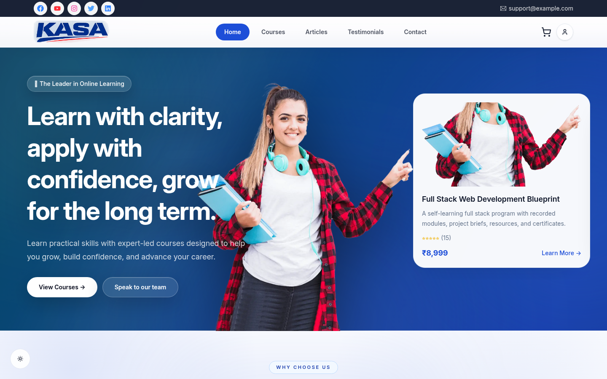
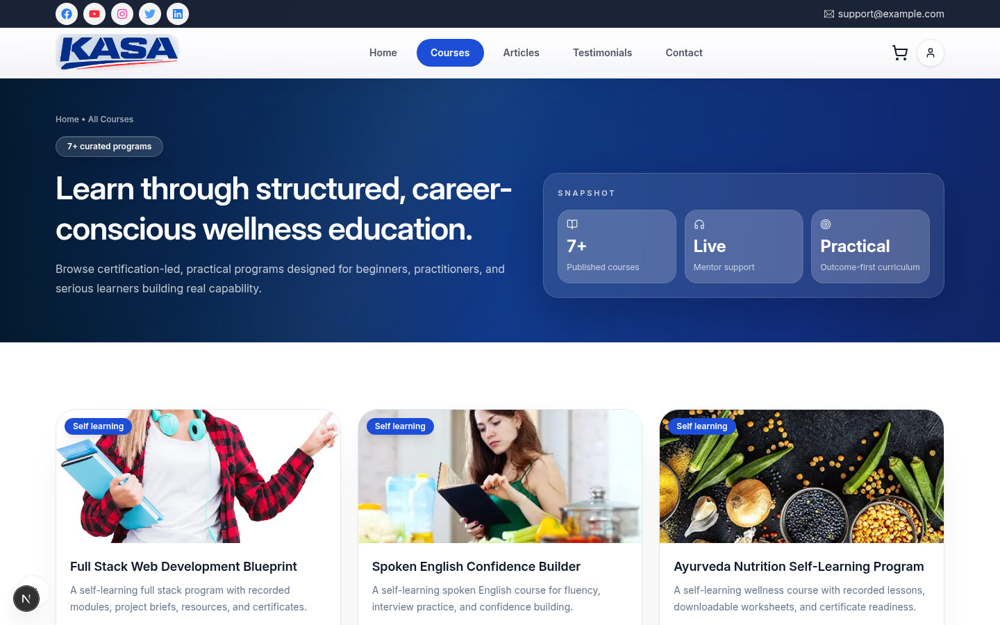
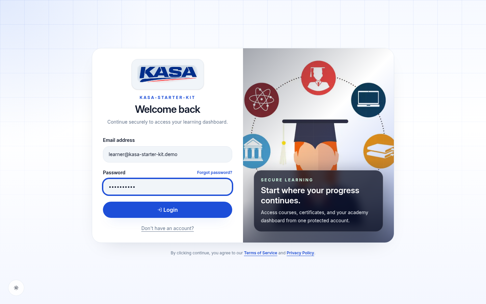
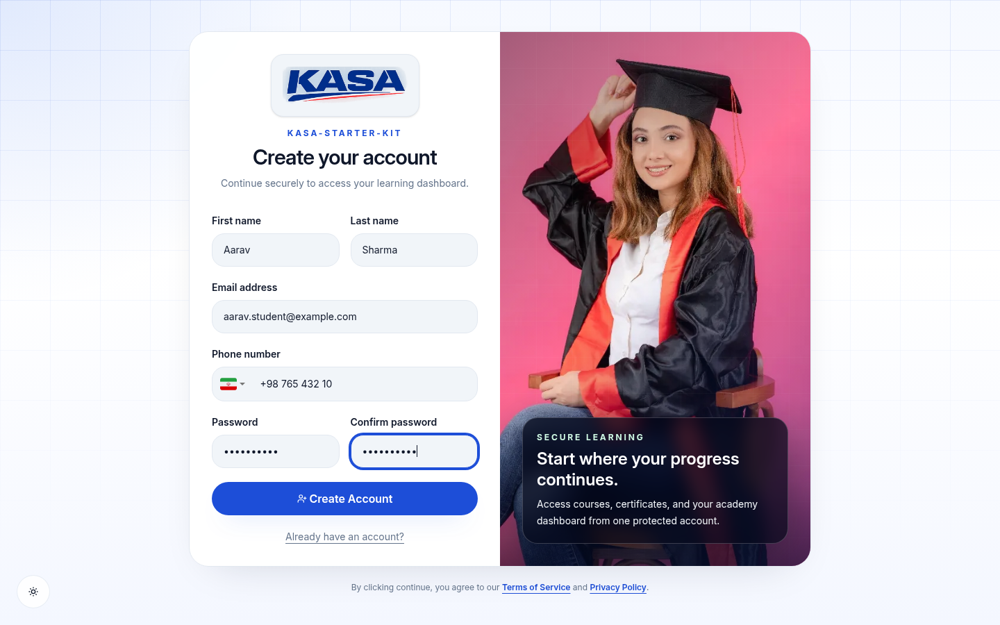
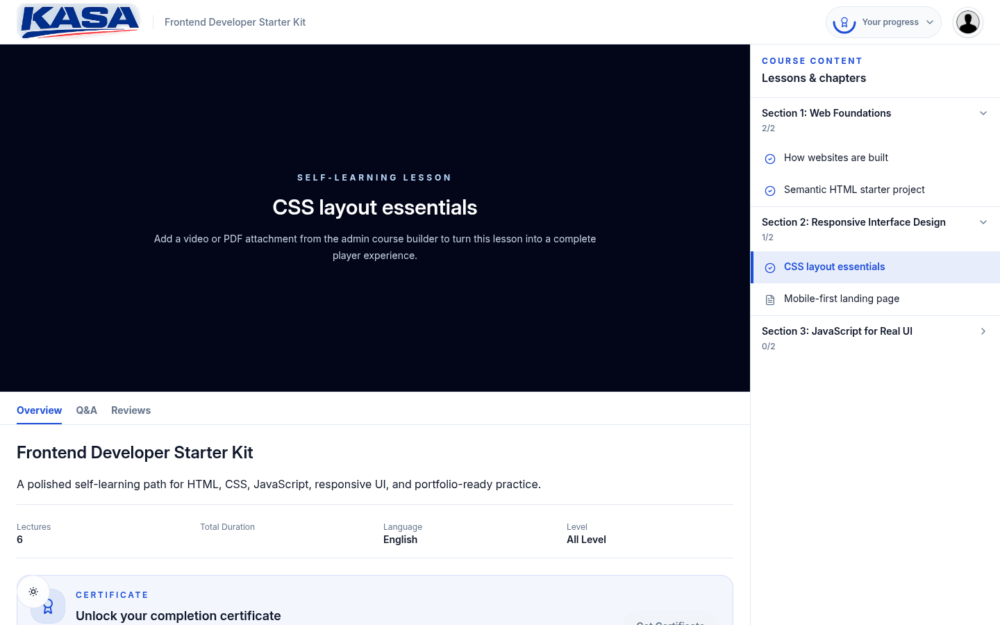
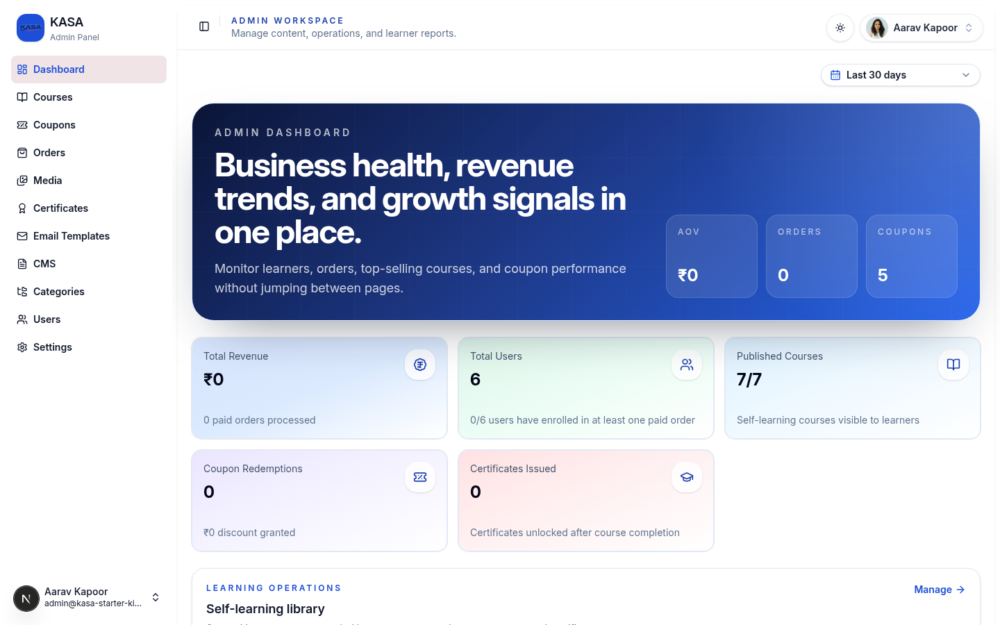
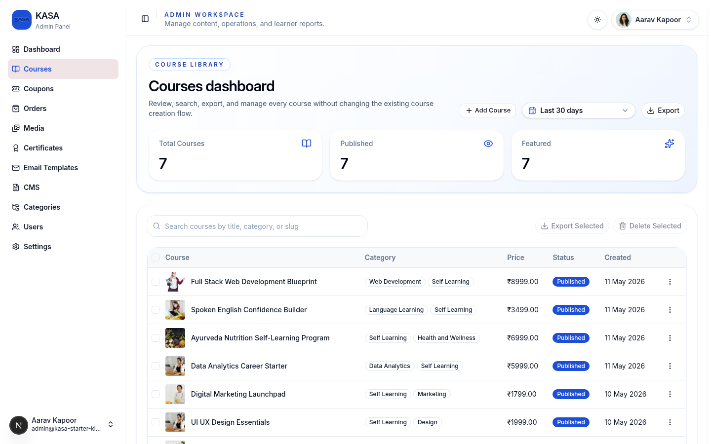
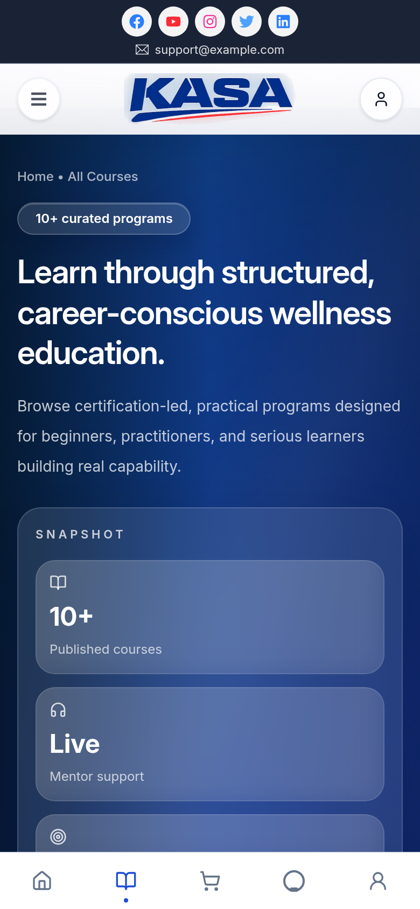

# kasa-starter-kit - Client

This is the frontend application of **kasa-starter-kit**, a full-stack Learning Management System built with **Next.js**, **React**, **TypeScript**, and **Tailwind CSS**.

The client handles the starter kit user interface for students and admins.

---

## Preview

### Home Page



### Course Catalog



### Login



### Sign Up



### Student Learning Player



### Admin Dashboard



### Courses Dashboard



### Mobile Home


### Mobile Courses



---

## Frontend Overview

The frontend provides a modern, responsive, role-based LMS interface. It includes public pages, authentication pages, student dashboard pages, admin dashboard pages, course pages, learning screens, article pages, and management dashboards.

The UI is designed around the starter roles with protected student and admin dashboard experiences.

---

## Features

### Public Pages

- Home page
- Course listing
- Course details page
- Articles page
- Single article page
- Contact page
- Testimonials section
- Responsive layout

---

### Student UI

- Student login and registration
- User dashboard
- Profile page
- Settings page
- Browse courses
- View course details
- Purchase courses
- Access purchased courses
- Watch course lessons
- Learning player
- Course overview screen
- Course reviews screen
- Track learning progress
- View certificates
- View purchase/order history

---

### Admin UI

- Admin dashboard
- Courses dashboard
- Course create/edit pages
- Categories dashboard
- Orders dashboard
- Coupons dashboard
- Role management dashboard
- Roles-permission dashboard
- Permission library dashboard
- Course reviews dashboard
- Contact leads dashboard
- Client testimonials dashboard
- Email templates dashboard
- Site settings dashboard
- Articles management pages

---

### Authentication & Authorization UI

- Login pages
- Register pages
- Token-based frontend auth
- Role-based redirects
- Protected dashboard routes
- Separate UI handling for Admin and Student

---

## Tech Stack

- Next.js
- React.js
- TypeScript
- Tailwind CSS
- Axios
- Component-based architecture
- Responsive UI
- Role-based protected routes
- Dashboard-based layout system

---

## Folder Structure

```txt
client/
  app/ or pages/
  components/
  hooks/
  lib/
  services/
  utils/
  public/
  package.json
  README.md
```

> Folder names may vary depending on the actual project structure.

---

## Installation

```bash
cd client
npm install
```

---

## Run Development Server

```bash
npm run dev
```

Client will run on:

```txt
http://localhost:3000
```

---

## Build for Production

```bash
npm run build
```

---

## Start Production Build

```bash
npm start
```

---

## Environment Variables

Create a `.env` file inside the `client/` folder.

```env
NEXT_PUBLIC_API_URL=http://localhost:5000
```

Also keep a public example file:

```env
NEXT_PUBLIC_API_URL=http://localhost:5000
```

File name:

```txt
client/.env.example
```

---

## Backend Connection

The frontend communicates with the backend API using:

```env
NEXT_PUBLIC_API_URL
```

Make sure the backend server is running before testing API-based pages such as login, dashboard, orders, coupons, course purchase, exams, progress, and admin modules.

---

## Main Frontend Sections

```txt
Home
Courses
Single Course
Articles
Single Article
Contact
Login
Register
User Dashboard
Admin Dashboard
Courses Dashboard
Course Edit
Learning Player
Learning Overview
Learning Exams
Learning Reviews
Orders
Coupons
Refunds
Roles
Permissions
Categories
Testimonials
Contact Leads
Email Templates
Site Settings
Tags
```

---

## Screenshot References

```txt
../screenshots/envato-focused/desktop-01-home-hero.png
../screenshots/envato-focused/desktop-02-courses-grid.png
../screenshots/envato-focused/desktop-03-articles.png
../screenshots/envato-focused/desktop-04-testimonials.png
../screenshots/envato-focused/desktop-05-contact.png
../screenshots/envato-focused/desktop-06-home-dark.png
../screenshots/envato-focused/mobile-01-home.png
../screenshots/envato-focused/mobile-02-courses.png
../screenshots/envato-focused/mobile-03-contact.png
../screenshots/envato-focused/mobile-04-home-dark.png
../screenshots/envato-focused/auth-01-login.png
../screenshots/envato-focused/auth-02-signup.png
../screenshots/envato-focused/student-01-learning-player.png
../screenshots/envato-focused/admin-01-dashboard.png
../screenshots/envato-focused/admin-02-courses.png
../screenshots/envato-focused/admin-03-users.png
../screenshots/envato-focused/admin-04-sales.png
../screenshots/envato-focused/admin-05-site-settings.png
../screenshots/envato-focused/admin-06-coupons.png
../screenshots/envato-focused/admin-07-testimonials.png
../screenshots/envato-focused/admin-08-contact-leads.png
```

---

## Important Notes

- Do not push `.env` files to GitHub.
- Do not push `node_modules`.
- Do not push `.next`.
- Keep reusable components organized.
- Keep API calls inside service/helper files.
- Keep dashboard sections separated by role.
- Keep protected routes properly handled.
- Keep UI responsive for different screen sizes.

---

## Author

**Satendra Kanak**

GitHub: [@satendrakanak](https://github.com/satendrakanak)
